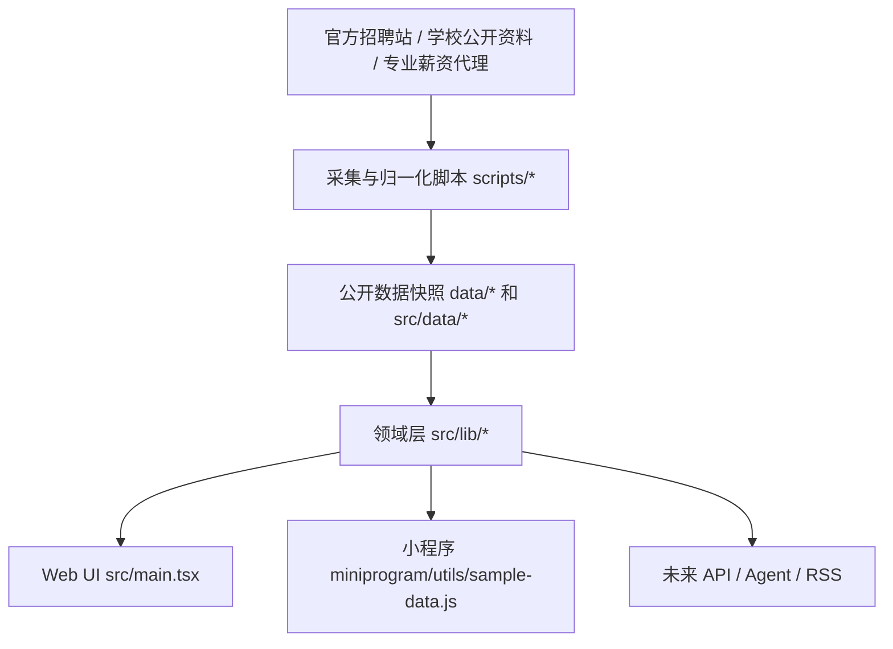

# 看看工资开发架构

更新日期：2026-06-20

## 1. 架构目标

看看工资的工程架构要服务四个原则：

- 证据优先：所有结论都能回到来源、口径和更新时间。
- 领域层复用：Web、小程序、未来 API 和 Agent 共用核心判断逻辑。
- 轻存储：不把一次搜索结果当永久事实库，长期只保存可公开、可复核、可脱敏的数据。
- 小程序适配：移动端首屏、底部 tab、轻数据包和无远程 JS 是默认约束。

## 2. 当前技术栈

- 前端：Vite + React + TypeScript。
- 图标：lucide-react。
- 数据脚本：tsx 脚本读取官方招聘站、生成归一化岗位和分析输出。
- 小程序：原生微信小程序目录在 `miniprogram/`。
- 视频物料：Remotion 项目在 `video-work/`，不参与主应用运行时。

## 3. 分层架构



## 4. 数据层

主要文件：

- `data/jobs.normalized.json`：官方招聘站归一化结果。
- `data/jobs.seed.json`：公开可展示岗位种子。
- `data/analysis.json`：岗位分析输出。
- `src/data/jobs.generated.ts`：前端使用的岗位快照。
- `src/data/officialSources.ts`：企业官方招聘入口和 adapter 状态。
- `src/data/majorMarket.ts`：专业薪资代理、公司需求画像。
- `src/data/schoolOutcomes.ts`：学校公开入口、就业证据和专业去向字段。

数据层只提供事实和代理口径，不直接决定 UI 展示排序。

## 5. 领域层

领域层负责把数据变成可解释判断。

- `src/lib/careerSignals.ts`：把岗位、薪资、学校证据、官方入口统一成 CareerSignal。
- `src/lib/careerRadar.ts`：岗位关键词到专业关联强度。
- `src/lib/officialJobSearch.ts`：基于当前官方岗位快照做临时聚合搜索。
- `src/lib/universityMatching.ts`：高校、专业、岗位直接匹配。
- `src/lib/schoolEvidence*.ts`：学校证据采集、信任等级、缺口和候选对比。
- `src/lib/companyLogos.ts`：公司 logo 本地资源和 fallback。

新业务规则优先进入 `src/lib/*`，不要直接写在 React 组件里。

## 6. 展示层

当前 Web 入口仍有大量历史代码集中在 `src/main.tsx`。V1.1 已先把职业信号面板拆到 `src/features/signals/`，后续继续按功能拆分：

- `src/features/school/*`
- `src/features/radar/*`：已开始落地，`CareerRadarPanel` 已独立，雷达证据聚合进入 `src/lib/careerRadarEvidence.ts`。
- `src/features/companies/*`
- `src/features/signals/*`：已开始落地，`CareerSignalHubPanel` 已独立。
- `src/components/common/*`

拆分顺序应遵循“先测后拆”：

1. 先给领域层和关键 UI 加验证脚本。
2. 再把组件从 `main.tsx` 移出。
3. 保持 `npm run build` 和现有 verify 脚本通过。

## 7. 小程序层

小程序目录：

- `miniprogram/app.json`
- `miniprogram/pages/index/*`
- `miniprogram/pages/companies/*`
- `miniprogram/pages/company-detail/*`
- `miniprogram/pages/radar/*`
- `miniprogram/utils/sample-data.js`

小程序不应包含远程 JS，不应把密钥放在客户端。首版以压缩后的样本数据、官方入口和本地 logo 为主。

## 8. 安全与合规边界

- 外链必须使用官方招聘站、学校官网、就业网或公开报告入口。
- 前端不执行远程 JS。
- 不把第三方招聘正文长文本原样发布；公开展示使用摘要和链接。
- 薪资估算必须标记，不能写成企业承诺。
- 学校就业数据没有专业级来源时不能伪造字段。
- 用户手动证据保存在本地时需要上限和弱证据提示。

## 9. 验证体系

推荐验证顺序：

```bash
npm run verify:career-signals
npm run verify:career-radar
npm run verify:school-rescue
npm run verify:miniprogram
npm run build
```

重点脚本：

- `scripts/verify-career-signals.ts`
- `scripts/verify-career-signal-ui.ts`
- `scripts/verify-career-radar-feature.ts`
- `scripts/verify-school-rescue-quality-gate.ts`
- `scripts/verify-wechat-miniprogram-package.ts`
- `scripts/verify-no-remote-js-execution.ts`
- `scripts/verify-job-data-publication-redaction.ts`
- `scripts/verify-company-logo-assets.ts`

## 10. 运营刷新

```bash
npm run update:salaries
```

该命令会重跑官方岗位采集和分析。未来应迁移到服务端定时任务，并只把必要公开快照发布到前端。

## 11. 近期技术债

- `src/main.tsx` 文件过大，功能边界不清。
- README、PRD、真实代码曾出现口径漂移，需要把验收写入 verify 脚本。
- 当前学校证据以手工整理为主，需要 PDF/就业网解析队列。
- 官方 adapter 对海外企业覆盖还不够。
- 小程序数据仍是样本，需要和 Web 领域层建立生成链路。
